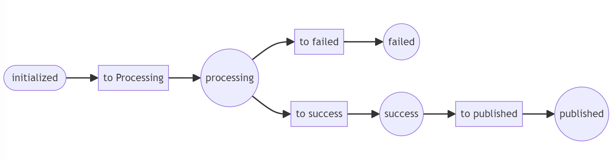

### Example Use Case

Simple use case to show how to create a catalog and importing its products from CSV on a database.

### State machine diagram 


### Setup

Run consume command on php container
```
$ make sh
$ php bin/console messenger:consume async
```

Open https://localhost/api/doc to browse API documentation

### Demo Steps

* Create a catalog and starting to import its products.

	Execute using default values or add a csv product file on storage directory.
	
	API endpoint: /api/catalog/create

* Publish a catalog whose status is success

	API endpoint: /api/catalog/{id}/progress

* To see catalog status

	API endpoint: /api/catalog/{id}/status


#### References

Workflow diagram genereated using:
```
php bin/console workflow:dump catalog --dump-format=mermaid 
```
